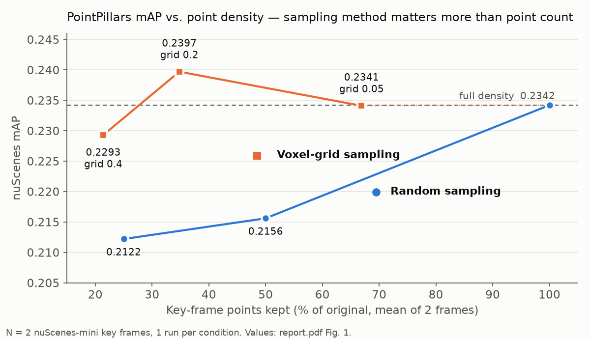

# 3D-PointCloud-DownUpSampling — how LiDAR point density affects PointPillars mAP

Voxel-grid downsampling to ~21% of key-frame points keeps nuScenes mAP within 0.005 of full density (0.2293 vs 0.2342); random sampling to 50% loses 0.019 (0.2156). **Detection was more sensitive to *how* points were removed than to *how many*.**

**Figure 1.** One nuScenes-mini keyframe at each density (% of keyframe points), with PointPillars mAP from the 2-frame pilot. The upsampled panel was regenerated with the same parameters for illustration.

## Key result

| Setting (PointPillars, nuScenes mAP) | Full density | Reduced | Δ |
|---|---|---|---|
| Voxel grid 0.4 → 21.4% of key-frame points | 0.2342 | 0.2293 | −0.0049 (−2.1%) |
| Voxel grid 0.2 → 34.8% of key-frame points | 0.2342 | 0.2397 | +0.0055 (+2.3%) |
| Random sampling → 50% of key-frame points | 0.2342 | 0.2156 | −0.0186 (−7.9%) |
| Random sampling → 25% of key-frame points | 0.2342 | 0.2122 | −0.0220 (−9.4%) |

*N = 2 nuScenes v1.0-mini LiDAR key frames (scene-0061, scene-0103); pretrained PointPillars, inference only; 1 run per condition, no seeds. Differences of ~0.005 mAP are within noise at this sample size. Sources and caveats: [`results/NUMBERS.md`](results/NUMBERS.md).*

## Motivation

Dense LiDAR point clouds cost latency and memory, so it is tempting to thin them before detection. Random sampling is the cheapest way to do that. Voxel-grid sampling costs more but keeps spatial coverage uniform. Upsampling is sometimes proposed to recover the lost points. This course project put the four methods side by side on a single pretrained detector. It asked two questions: how far can density drop before mAP falls, and does the sampling method matter?

## Method

Pipeline: pick 2 nuScenes key frames → resample the key-frame points (`.bin`, 5 floats/pt) → run pretrained PointPillars (MMDetection3D) → nuScenes mAP.

1. **Downsampling.** Two methods at three levels each (`Upsanpling_DownSampling.ipynb`, cell 16):
   - Random: 100 / 50 / 25% of points.
   - Voxel grid (Open3D, features averaged per voxel): grid size 0.05 / 0.2 / 0.4, which keeps 67 / 35 / 21% of points.
2. **Upsampling.** Restores the random 25% and 50% clouds to the original point count (cells 18–19):
   - Gaussian jittering: duplicates points and adds σ = 0.02 noise.
   - Voxel interpolation: adds midpoints of point pairs within each voxel, grid 0.4.
3. **Detector held fixed.** The nuScenes-pretrained PointPillars (`pointpillars_hv_secfpn_sbn-all_8xb4-2x_nus-3d`) ran on every condition with no fine-tuning. Any change in mAP therefore comes from the input alone.

## Results

**Downsampling** (report Fig. 1, also plotted above):

| Condition | Key-frame points kept | mAP |
|---|---|---|
| Full density | 100% | 0.2342 |
| Voxel 0.05 | 66.9% | 0.2341 |
| Random 50% | 50.0% | 0.2156 |
| Voxel 0.2 | 34.8% | 0.2397 |
| Random 25% | 25.0% | 0.2122 |
| Voxel 0.4 | 21.4% | 0.2293 |

**Upsampling back to 100%** (report Fig. 2). Neither method recovered full-density mAP. Gaussian jittering recovered more than voxel interpolation, which fell below its own input at 25%.

| Input | Downsampled mAP | + Gaussian jitter | + Voxel interpolation |
|---|---|---|---|
| Random 25% | 0.2122 | 0.2153 | 0.2110 |
| Random 50% | 0.2156 | 0.2232 | 0.2193 |

**Limitations:**
- **Small sample.** Every number comes from 2 frames and a single run.
- **Key frame only.** The saved eval config loads 10 LiDAR sweeps (`LoadPointsFromMultiSweeps`), and only the key frame was resampled. The detector's *effective* input density therefore changed less than the "% kept" column suggests.
- **Logs cover few conditions.** The logs in `3d_object_detection/results/` confirm the baseline (0.2342) and Random 50% (0.2156). The other values are only in the report figures. No latency or memory was measured.

## Reproduce

Experiments were run with MMDetection3D on a team member's GPU server; the evaluation was not re-run for this README.
- Point-cloud resampling (down/upsampling, `.npy → .bin`): `Upsanpling_DownSampling.ipynb`
- Resampled key frames: `3d_object_detection/downsampled_bin/`
- Evaluation configs and metric JSONs: `3d_object_detection/results/<timestamp>/`
- mAP bar chart: `python results/make_hero.py` (matplotlib only; writes `results/map_by_condition.png` from `results/NUMBERS.md` values; does not touch `assets/hero.png`)
- BEV panels: `python scripts/render_fig_assets.py`

## Context

- **Type:** Course project, CIE6032 Deep Learning Foundations and its Applications (Prof. Li Zhen), CUHK-Shenzhen
- **Period:** Jun 2025 – Jul 2025
- **Collaborators:** Team of 3: Kim Junseok, Wu Xiaolong, Yao Junguang
- **My contribution:** Team lead (proposed the topic, planned the experiments). I implemented the down/upsampling preprocessing pipeline: frame selection, random and voxel-grid downsampling, Gaussian jittering, voxel interpolation, and `.bin` export (`Upsanpling_DownSampling.ipynb`). Teammates ran the PointPillars evaluation and wrote most of the report.
- **Status:** Completed; archived. Full report: [`report.pdf`](report.pdf); setup notes: [`Readme.pdf`](Readme.pdf).

## Citation / Acknowledgements

- Detector code: [MMDetection3D](https://github.com/open-mmlab/mmdetection3d), Apache-2.0 (vendored in `3d_object_detection/`; see its `LICENSE`).
- Data: Caesar et al., *nuScenes: A multimodal dataset for autonomous driving*, CVPR 2020.
- Model: Lang et al., *PointPillars: Fast encoders for object detection from point clouds*, CVPR 2019.
- Thanks to Prof. Li Zhen and the course TAs.
